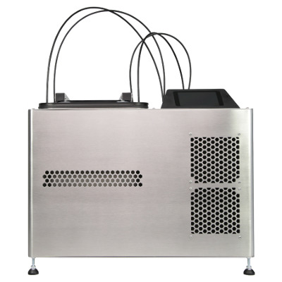

PCB Arts Vapor Phase One (VPO) Core Controller Firmware
=======================================================

This repository contains the firmware source code for the `Vapor Phase One 
<https://pcb-arts.com/en/vapor_phase_one>`_ by PCB Arts.

#####################
Want a tested and certified Vapor Phase One?
#####################

Checkout: https://shop.pcb-arts.com/products/vapor-phase-one

#########
Checkout
#########

This repository includes some upstream ST code as submodules. When cloning or pulling this repo, pass
``--recurse-submodules`` to git: ``git clone --recurse-submodules [...]``.

#####################
Building and Signing
#####################

Building the project STM32CubeIDE is required.

In general you have to loosely follow these steps to build and sign images for the bootloaders.

1. Import the projects into a workspace.
2. Generate a key for image signing. For development this can be achieved by running ``generate_dev_key.sh`` from the tools folder of the display bootloader. 
3. Build the bootloaders.
4. Flash the bootloaders. e.g. using STM32CubeProgrammer, or using the RUN command
5. Build the user application firmwares.
6. (Option 1) Directly flash the firmwares onto devices (use the the output elf file).  e.g. using STM32CubeProgrammer, or using the RUN command
7. (Option 2) Sign the images by running ``sign_all_images.sh`` from the tools folder of the display bootloader.
8. (Option 2) Copy the signed (without _unsigned) `.BIN` files onto an SD card. And flash using the bootloader.

#####################
Flashing
#####################

#####################
Display
#####################

Flash the display with the STM32CubeProgrammer, as external Loader use the MT25QL128A_STM32469I-DK. Flash the Bootloader and then the .elf file in bootloader-production folder.
